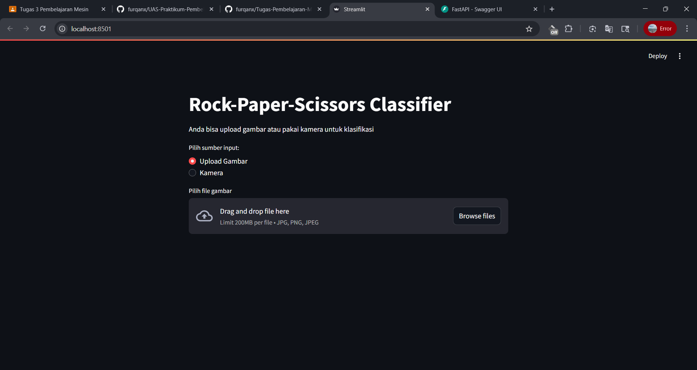
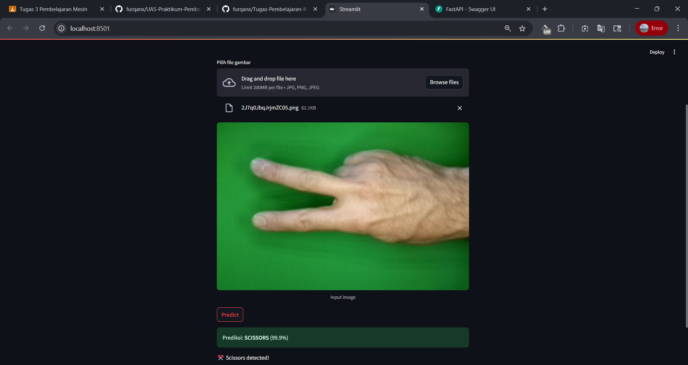
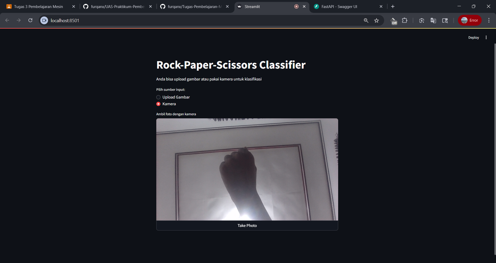
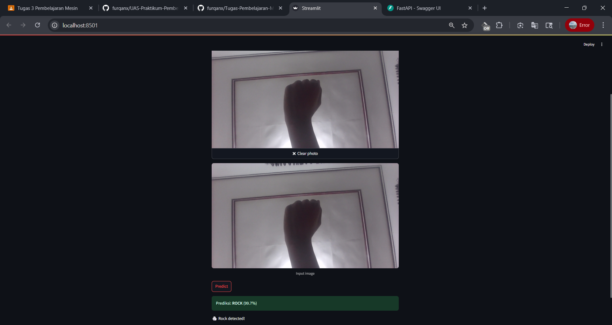
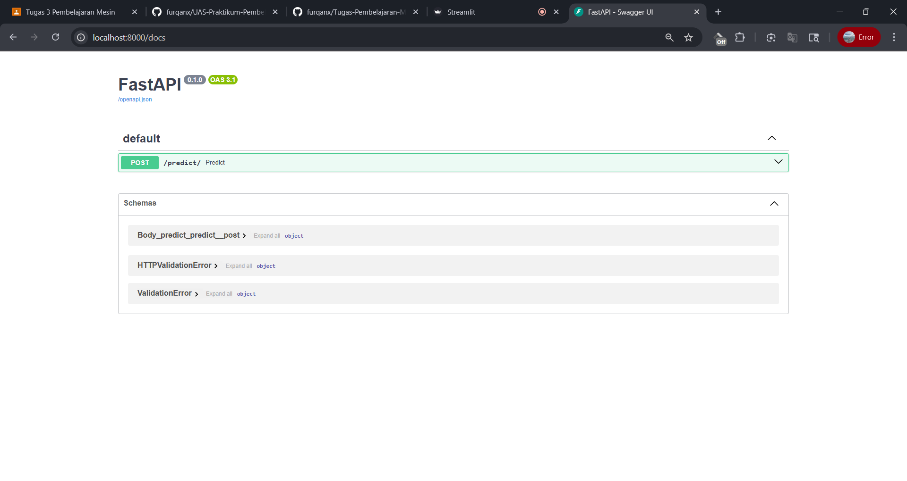
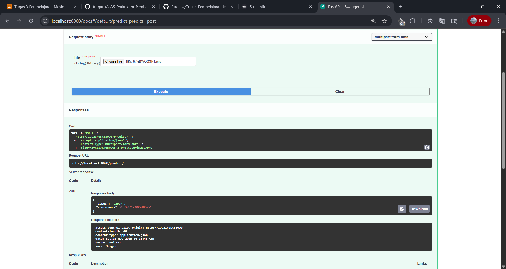

# Rock-Paper-Scissors Classification Project 🪨📄✂️

---

## 📚 Deskripsi Proyek

Proyek ini bertujuan untuk membangun sistem klasifikasi gambar sederhana menggunakan **Deep Learning** dengan pendekatan **Transfer Learning** (menggunakan arsitektur MobileNetV2).
Klasifikasi gambar dilakukan terhadap tiga kategori: **Rock**, **Paper**, dan **Scissors**.

Model hasil pelatihan kemudian diintegrasikan ke dalam aplikasi berbasis web yang terdiri dari:

* **Backend (FastAPI)**: menerima gambar dan memberikan prediksi.
* **Frontend (Streamlit)**: antarmuka pengguna untuk mengunggah gambar dan melihat hasil klasifikasi secara real-time.

---

## 🛠️ Teknologi yang Digunakan

* **TensorFlow / Keras** — Untuk membangun dan melatih model klasifikasi.
* **FastAPI** — Backend REST API yang menangani prediksi gambar.
* **Streamlit** — Frontend interaktif untuk pengguna.
* **Uvicorn** — ASGI server untuk menjalankan FastAPI.
* **PIL (Pillow)** — Untuk pemrosesan gambar.
* **NumPy** — Untuk manipulasi data numerik.
* **scikit-learn** — Untuk evaluasi performa model (confusion matrix, classification report).

---

## 📂 Struktur Folder Proyek

```
Tugas3_MilaLestari_2208107010002/
├── asset/ # Gambar hasil prediksi untuk ditampilkan di README
├── backend/
│ ├── main.py # Backend FastAPI
│ └── requirements.txt
├── dataset/ # Dataset gambar untuk training/testing
│ ├── rock/
│ ├── paper/
│ └── scissors/
├── frontend/
│ ├── app.py # Frontend Streamlit
│ └── requirements.txt
├── model/
│ └── best_transfer.h5 # Model hasil training
├── notebook.ipynb # Notebook eksplorasi dan training model
└── venv/ # Virtual environment (opsional)
```

---

## 🚀 Langkah-Langkah Instalasi dan Penggunaan

### 1. Clone Repository

```
git clone https://github.com/milalestari/Tugas3_MilaLestari_2208107010002  
cd Tugas3_MilaLestari_2208107010002
```

### 2. Buat dan Aktifkan Environment Virtual (Opsional tapi Disarankan)

```
python -m venv venv
# Windows
venv\Scripts\activate
# macOS/Linux
source venv/bin/activate
```

### 3. Instal Semua Dependency

Gabungkan dependencies dari backend/requirements.txt dan frontend/requirements.txt:

```
pip install -r backend/requirements.txt
pip install -r frontend/requirements.txt
```

### 4. Download Dataset Rock-Paper-Scissors

Unduh dataset Rock-Paper-Scissors dari Kaggle:
🔗 [Rock-Paper-Scissors Dataset – Kaggle](https://www.kaggle.com/datasets/drgfreeman/rockpaperscissors)

Setelah download dan ekstrak:

* Susun dataset ke dalam folder:

```
dataset/
    rock/
    paper/
    scissor/
```

### 5. Jalankan Aplikasi

✅ Jalankan Frontend (Streamlit)

```
cd frontend
streamlit run app.py
```

Streamlit akan berjalan di `http://localhost:8501/`

✅ Jalankan Backend (FastAPI)

Buka terminal baru:

```
cd backend
uvicorn main:app --host 0.0.0.0 --port 8000 --reload
```

Server akan berjalan di `http://localhost:8000/`.

### 📸 Output Hasil Prediksi

Berikut adalah contoh hasil klasifikasi menggunakan model dan aplikasi yang telah dibangun:

<p align="center">    </p> <p align="center">     </p>
